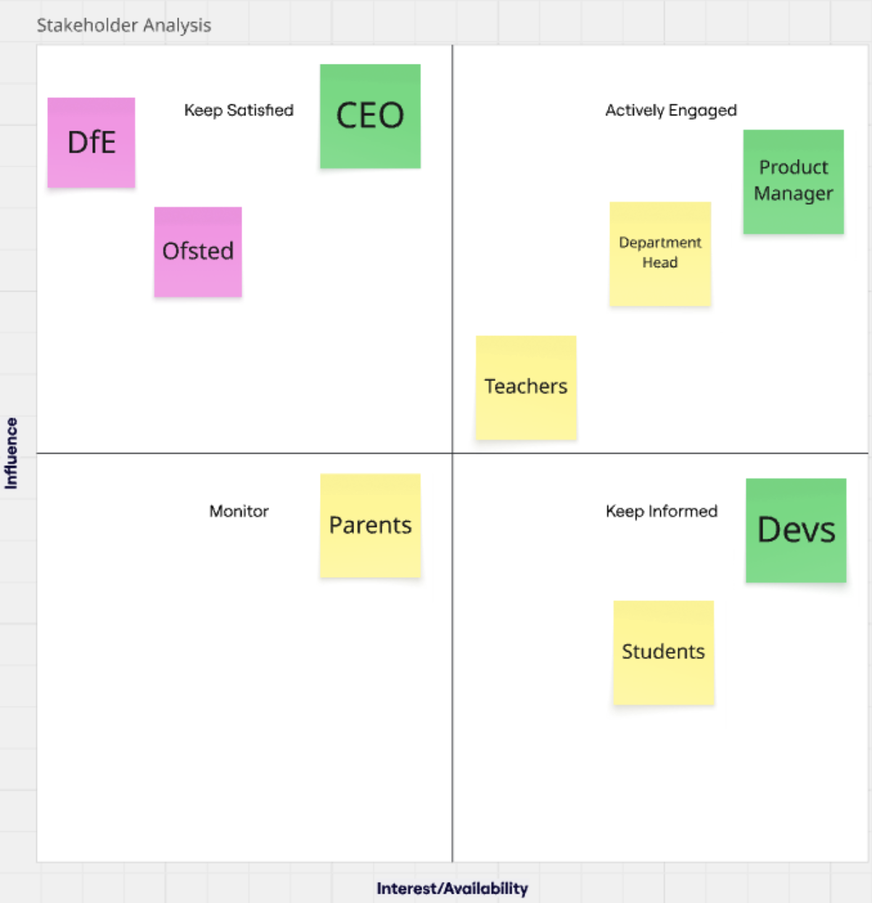

# Stakeholder Analysis

## Business Context

The Hive Foundation have identified a recurring problem with student engagement amongst non-STEM subjects. Students find that non-STEM subjects are repetitive and not as interesting as STEM subjects. Teachers echo this issue as they find it harder to plan non-STEM lessons in an engaging way for students. Due to this main issue, the Hive group want a solution that promotes a more balanced approach between STEM and non-STEM subjects that increases engagement for students.

## Stakeholder Analysis Grid

### Key Stakeholder 

- **Teachers** 
(**Medium Influence / Medium Interest**)
 
   - Teachers create lesson plans and will be the group that integrates the web app into their classrooms

   - They are in the actively engaged quadrant as the solution actively affects their lesson planning; therefore they need to be up to date with any additions being made to the web app but they do not directly fund the project, therefore their influence isn't as high

- **Students**
(**Low Influence / High Interest**)

   - Students are the end users that will engage with the web app daily

   - They are in the keep informed quadrant as they have the highest interest out of the three key stakeholders due to the solution being directly tailored around their engagement and enjoyment. They have the lowest level of influence as they are only end users/consumers for the web app

- **Parents**
(**Medium Influence / Medium Interest**)

   - Parents observe the effects of their children's engagement with the web app and how it correlates with their overall learning.

   - They are in the monitor quadrant as they have a lower level of influence compared to teachers because they are not involved in the building or using of the web app. They have the second-highest level of interest amongst key stakeholders as several parents have already flagged that their children are not having fun with their education, which shows their interest in a solution to this problem

### Other Stakeholders

- **CEO**
(**High Influence / Medium Interest**)

  - The CEO commissions the creation of the web app as a solution to the problem they have identified

  - They have high influence as they control the overall direction of the project, but medium interest as they do not need to be kept up to date with every change made

- **Department Head**
(**High Influence / High Interest**)

  - The Department Head is responsible for the delivery of the curriculum and overall outcome of their specific department

  - They have high influence as they choose whether the department adopts the web app into their learning. They also have high interest as the students overall engagement and performance are their main responsibility

- **Product Manager**
(**High Influence / High Interest**)

  - The PM organises the overall planning and delivery of the project. They act as the liason between the CEO and the dev team

  - They have high influence as they execute the decision-making of the project in line with the CEO's interests. They have high interest as they hold accountability for the project's delivery and overall success

- **Devs** (**Developers**)
(**Medium Influence / High Interest**)

  - The developers build the product (web app) 

  - They have medium influence as they actively build the web apps front and back end, but they build in line with the Product Manager's vision. They have high interest as they are actively building the web app day by day.

- **DfE** (**Department for Education**)
(**High Influence / Low Interest**)

  - The DfE sets the framework for the curriculum the web app will follow

  - They have high influence as their guidance documentation dictates what the web app can implement. They have low interest as they are not particularly invested in this specific web app that's being developed

- **Ofsted** 
(**High Influence / Low Interest**)

  - Ofsted inspects the performance of schools and judge the quality of teaching

  - They have high influence as they judge students engagement and overall performance. They have low interest as this specific programme is not important to them

# Solution Analysis

## Main Challenges

- Students have lower engagment in non-STEM subjects
- Students having problems with retantion as non-STEM subjects rely heavily on textbooks
- Knowledge in non-STEM subjects have become *superficial* and lack depth compared to STEM subjects

## Solution Proposal

The solution to these challenges is an educational web game called EduFun that turns teaching into a text-based adventure game.

## Solution Analysis

The web application directly targets the main challenges listed by students and teachers alike.

- It increases engagement by making learning more interactive for students

- It helps memory retention as students will be applying knowledge through questions and learning from their mistakes

- Through an interactive game interface, students will take learning non-STEM subjects more seriously as feedback will be immediate and the game's functionality will help drive home the impact of what they are learning.