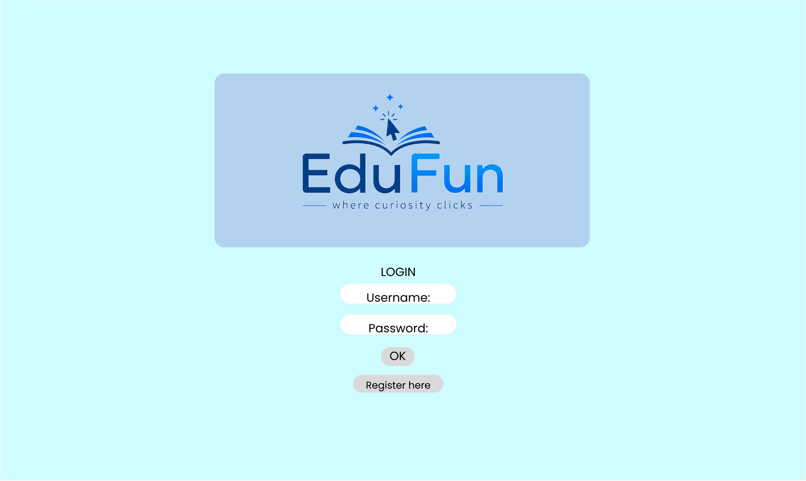
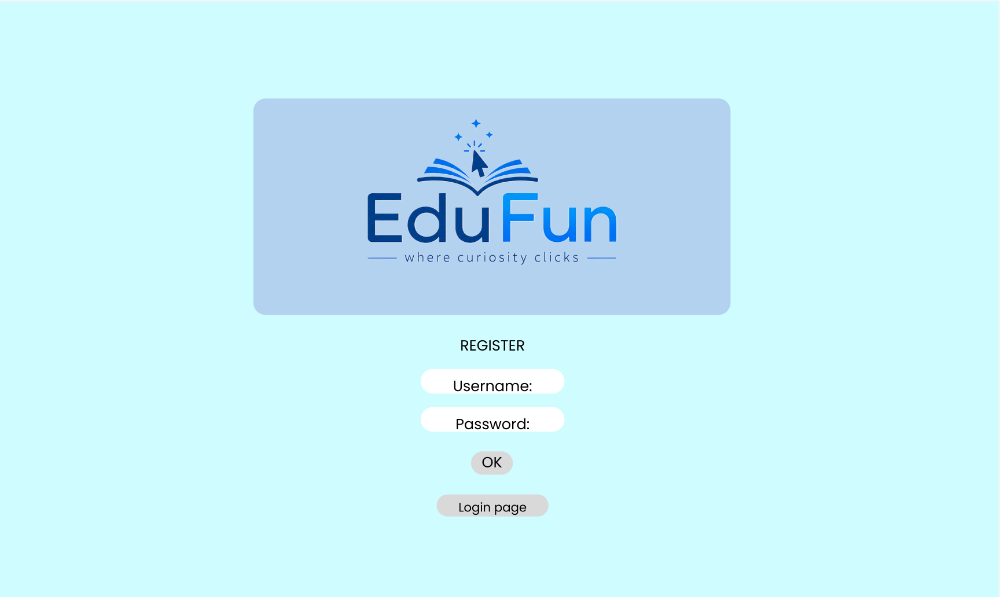
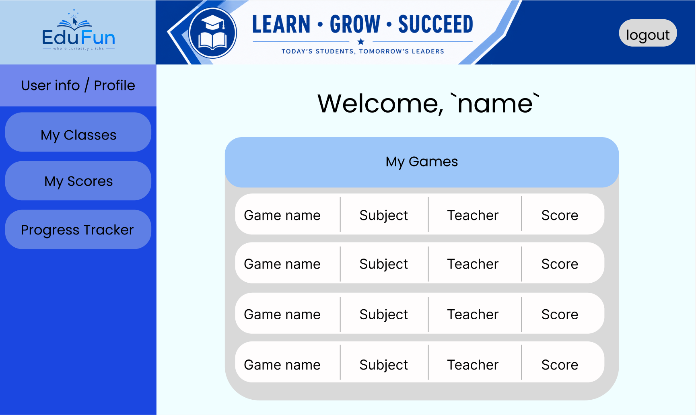
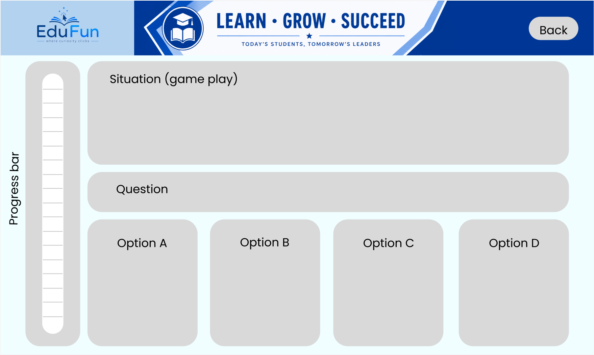
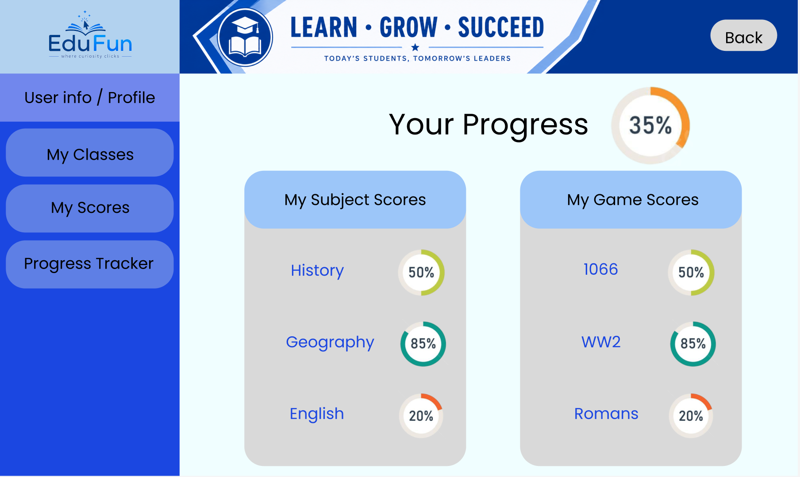

# Wireframes 

## Log In Wireframe

This is the first page a user will see. The page allows users to log in with a created username and password. It has *OK* button for continuing to the next page and a *Register Here* button for users who havent logged in before.

## Registration Wireframe

This page allows users to register an account by creating a username and password. From here they can press *OK* to create the account and then press *Login page* to go back to the log in page to log in and access the game.

## Home Page Wireframe

This is the main page for the game. you can access a game of your choosing by clicking on the *game name*. You can also see the subject of the game, the teacher that teaches that subject and your most recent score for that game. On the bar to the left of the page you can access your user information, your classes, your scores, and a progress tracker. There is also an option in the top right corner to logou and be taken back to the Log in page.

## Game Page Wireframe

The game page is where the scenario based educational page is played. The *situation* panel walks through the educational scenario you will be asked questions on. There will be 4 scenarios so 4 questions and 4 options for each quesion. There is a progress bar on the left that shows you how far you are in the game. The back button takes you back to the homepage.

## Progress Page Wireframe 

This page is the final page after you have finished all 4 scenarios on the game page. You can see your game scores on the right and your overall subject scores. On the left bar you can see the same layout for the game page bar. In the top right corner the back button will take you back to the home page to restart the game.