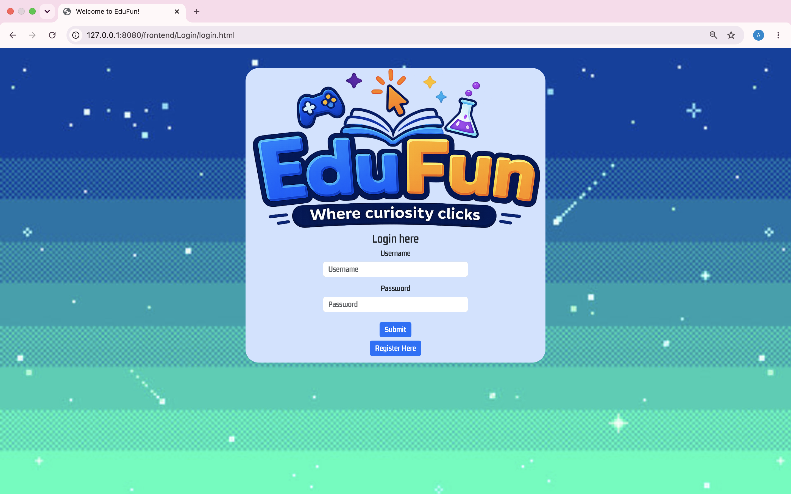
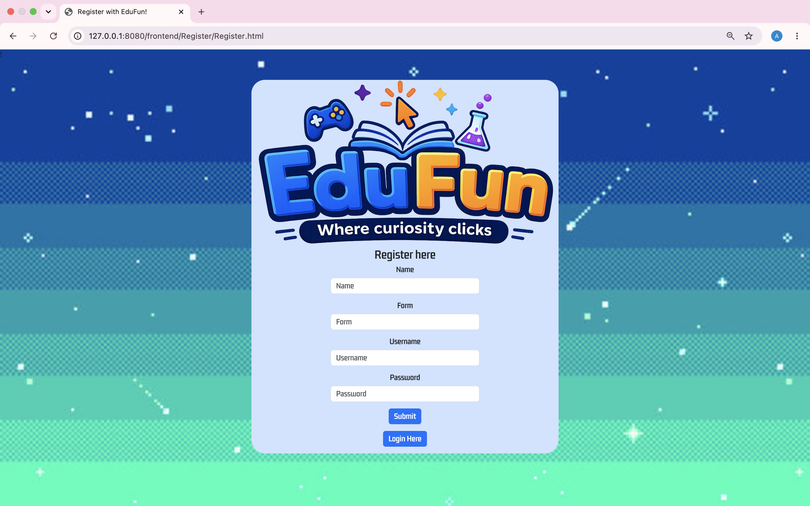
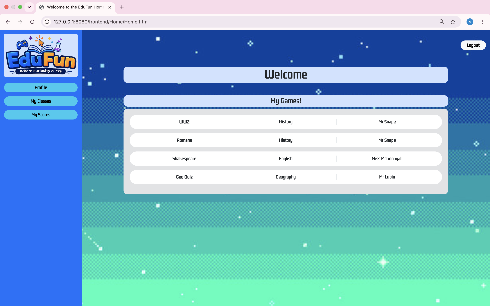
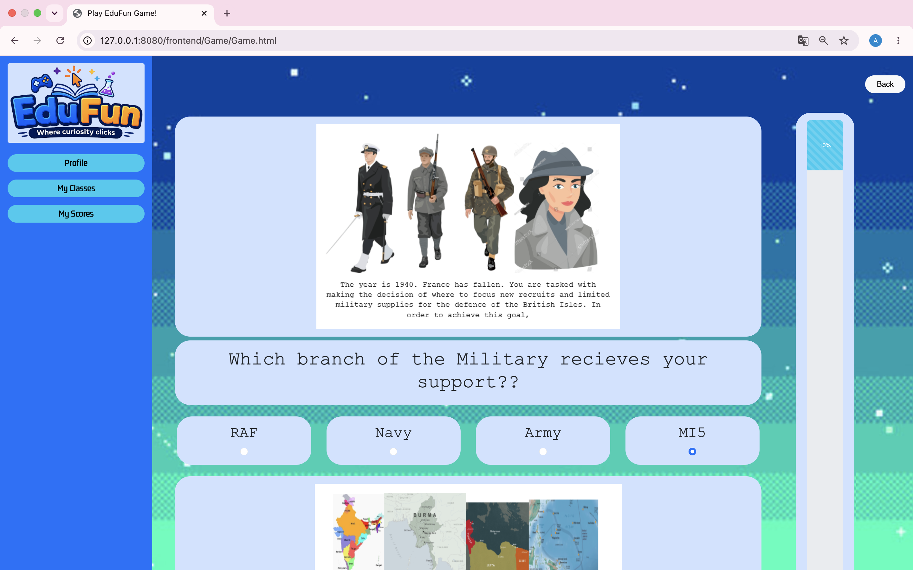
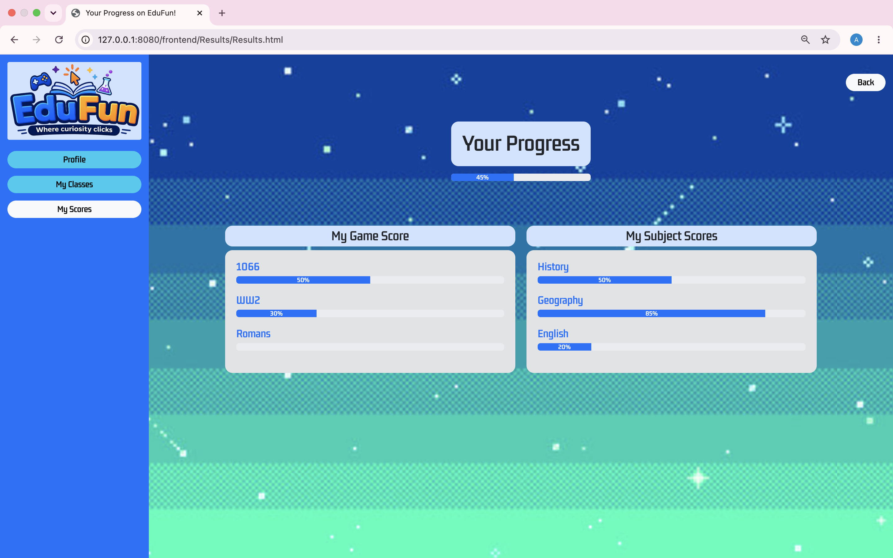

# EduFun

> Developed as part of a team project at La Fosse Academy, with contributions focused on backend development, database integration, API design, authentication, and automated testing.

EduFun is a full-stack educational gaming platform designed to improve student engagement through interactive, scenario-based learning experiences.

Built using JavaScript, Node.js, Express, PostgreSQL, REST APIs, Jest, and Supertest, the application allows users to register, complete educational quiz challenges, track their progress, and view their results through an interactive web interface.

---

## Technologies

### Backend
- Node.js
- Express
- JavaScript

### Database
- PostgreSQL

### Testing
- Jest
- Supertest
- JSDOM

### Development
- Git
- GitHub
- Agile Methodologies

---

## Key Features

- User registration and authentication
- Educational quiz challenges
- Scenario-based learning experiences
- Progress tracking and score management
- PostgreSQL database integration
- RESTful API architecture
- MVC backend structure
- Unit and integration testing
- Team-based Agile development

---

## User Journey

1. Register an account and log in.
2. Select an educational challenge from the home screen.
3. Progress through interactive quiz scenarios.
4. Track completion using the built-in progress tracker.
5. View individual game scores and overall learning progress.

The application was designed to improve student engagement by combining educational content with interactive gameplay mechanics.

---

## Architecture

```text
Frontend
    ↓
REST API
    ↓
Express
    ↓
PostgreSQL
```

---

## My Contribution

My primary contributions focused on backend development, including:

- Designing and implementing REST API endpoints
- PostgreSQL database integration
- Authentication functionality
- MVC application architecture
- Unit testing with Jest
- Integration testing with Supertest
- Database schema development
- Collaborative Git workflow and Agile delivery

---

## Project Structure

```text
EduFun
├── frontend
│   ├── Login
│   ├── Register
│   ├── Home
│   ├── Game
│   ├── Results
│   └── __tests__
│
├── backend
│   ├── server
│   │   ├── Models
│   │   ├── Controllers
│   │   ├── Routers
│   │   ├── Middleware
│   │   └── DB
│   │
│   └── __tests__
│
└── Project-Management
    ├── Wireframes
    ├── Database Schema
    └── Solution Diagrams
```

---

## Installation

Clone the repository:

```bash
git clone https://github.com/ArshaanSindhwani/EduFun.git
```

Install backend dependencies:

```bash
cd backend
npm install
```

Install frontend dependencies:

```bash
cd ../frontend
npm install
```

---

## Running the Application

Start the backend:

```bash
cd backend
npm start
```

Start the frontend:

```bash
cd ..
npx live-server
```

---

## Testing

Run backend tests:

```bash
cd backend
npm test
```

Run frontend tests:

```bash
cd frontend
npm test
```

---

## Screenshots

| Login | Registration |
|--------|--------|
|  |  |

| Home | Game |
|--------|--------|
|  |  |

| Results |
|--------|
|  |

---

## What I Learned

This project strengthened my understanding of:

- Building RESTful APIs with Express
- PostgreSQL database design and integration
- Authentication and user management
- Test-driven development principles
- Unit and integration testing
- Agile team collaboration
- Git branching and merge workflows

---

## Future Improvements

- Additional educational subjects and challenges
- Teacher dashboards and analytics
- Enhanced progress tracking
- Achievement and reward systems
- Responsive mobile-first design
- Cloud deployment and CI/CD pipelines
